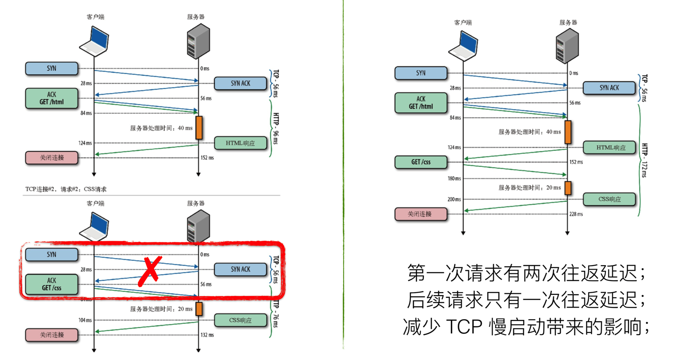

# HTTP2协议-概览

HTTP/1.1 自从 1997 年发布以来，我们已经使用 HTTP/1.x 相当长一段时间了，但是随着近十年互联网的爆炸式发展，从当初网页内容以文本为主, 到现在以富媒体（如图片、声音、视频）为主, 而且对页面内容实时性要求高的应用越来越多 （如聊天、视频直播）, 于是当时协议规定的某些特性，已经无法满足现代网络的需求了。


## HTTP1.1 协议缺陷

1. 请求响应延迟问题

HTTP1.0协议模型只支持请求-响应，所有的请求和响应是串行的，也就是说HTTP协议客户端发送一个请求必须要等到服务端响应之后才能再发下一个请求，并且每次请求时必须重新创建TCP连接，这种通信模型效率很低，根本无法满足通信需求。

HTTP1.1增加了Keep-alive机制和Pipelining机制，前者主要解决每次HTTP请求必须要创建TCP连接的问题；后者主要解决请求-响应串行问题。

<!--more-->

Keep-alive指的是客户端和服务器在TCP建联之后双方保持连接，减小因为TCP建连三次握手的开销，HTTP1.1协议默认开启keep-alive，http1.0需要设置Connection: Keep-Alive头部来启用。Chrome浏览器针对单个域名最多支持6个连接，连接开启多了则消耗客户端和服务器资源，连接太少则通信效率低。Keep-alive可缓解请求响应延迟，但是该方案不是最优。

​    

 

Pipeline机制本质是合并请求提高服务器资源的利用，该机制目前有个`队列头部阻塞问题`，该问题指的是**当顺序发送的请求序列中的一个请求因为某种原因被阻塞时，在后面排队的所有请求也一并被阻塞，会导致客户端迟迟收不到数据**。**产生头部阻塞的根本原因是因为HTTP1.1响应包因为不携带序号之类的机制，所以HTTP服务器在响应请求时需要顺序响应，如果前一个响应阻塞则后面响应内容会延迟**。


2. HTTP头部消耗

 HTTP1.1头部中携带很多header信息，例如User-Agent、Cookie、Server、Accept等，对于body只有几十字节的请求，header大小有时候高达到数百字节。Header 里携带的内容过大，在一定程度上增加了传输成本。更要命的是，成千上万的请求响应报文里有很多字段值都是重复的，非常浪费。

```
accept-ranges: bytes
age: 123163
alt-svc: quic=":443"; ma=2592000; v="46,43",h3-Q050=":443"; ma=2592000,h3-Q049=":443"; ma=2592000,h3-Q048=":443"; ma=2592000,h3-Q046=":443"; ma=2592000,h3-Q043=":443"; ma=2592000
cache-control: public, max-age=31536000
content-encoding: br
content-length: 46751
content-type: text/javascript; charset=UTF-8
date: Thu, 28 Nov 2019 17:37:15 GMT
expires: Fri, 27 Nov 2020 17:37:15 GMT
last-modified: Wed, 27 Nov 2019 21:19:14 GMT
server: sffe
status: 200
vary: Accept-Encoding
x-content-type-options: nosniff
x-xss-protection: 0
```


3. 明文传输带来的安全问题

  HTTP/1.1 在传输数据时，所有传输的内容都是明文，客户端和服务器端都无法验证对方的身份，这在一定程度上无法保证数据的安全性。


## SPDY协议

SPDY 是 Google 开发的一个实验性协议，于 2009 年年中发布，其主要目标是通过解决 HTTP/1.1 中广为人知的一些性能限制来减少网页的加载延迟。具体来说，这个项目设定的目标如下：

- 页面加载时间 (PLT) 减少 50%。
- 无需网站作者修改任何内容。
- 将部署复杂性降至最低，无需变更网络基础设施。
- 与开源社区合作开发此新协议。
- 收集真实性能数据，验证实验性协议是否有效。

目前Chrome已在2016年停止对SPDY的支持，采用支持HTTP2协议，SPDY协议当做HTTP2协议基础，并由此演变为HTTP2协议。


## HTTP2 协议

2015 年，HTTP/2 发布。HTTP/2 是现行 HTTP 协议（HTTP/1.x）的替代，但它不是重写，HTTP 方法 / 状态码 / 语义都与 HTTP/1.x 一样。**HTTP/2 基于 SPDY，专注于性能，最大的目标是在用户和网站间只用一个连接（connec-tion）**。从目前的情况来看，国内外一些排名靠前的站点基本都实现了 HTTP/2 的部署，使用 HTTP/2 能带来 20%~60% 的效率提升。

HTTP/2 由两个规范（Specification）组成：

1. Hypertext Transfer Protocol version 2 - RFC7540
2. HPACK - Header Compression for HTTP/2 - RFC7541


## HTTP2 特性

### 二进制传输 

HTTP2采用二进制传输数据，HTTP1.1采用纯文本方式传输，二进制协议解析会更为高效。**HTTP/2 将请求和响应数据分割为更小的帧，并且它们采用二进制编码**

HTTP2采用数据帧传输的方式有点像TCP协议一样采用报文分片+序号来解决数据分割之后乱序传输问题。HTTP1.1的数据会被划分为`HEADER帧`和`DATA帧`。采用数据分帧+序号的方式传输之后可以解决HTTP1.1每个连接双向传输问题，可以解决单连接上数据队头阻塞问题


#### 数据流/消息/帧

- *数据流*：已建立的连接内的双向字节流，可以承载一条或多条消息。
- *消息*：与逻辑请求或响应消息对应的完整的一系列帧。
- *帧*：HTTP/2 通信的最小单位，每个帧都包含帧头，至少也会标识出当前帧所属的数据流。


1. 所有通信都在一个 TCP 连接上完成，此连接可以承载任意数量的双向数据流。
2. 每个数据流都有一个唯一的标识符和可选的优先级信息，用于承载双向消息
3. 每条消息都是一条逻辑 HTTP 消息（例如请求或响应），包含一个或多个帧。
4. 帧是最小的通信单位，承载着特定类型的数据，例如 HTTP 标头、消息负载等等。 来自不同数据流的帧可以交错发送，然后再根据每个帧头的数据流标识符重新组装。

  

连接/数据流/帧之间的关系图如下所示，HTTP/2 将 HTTP 协议通信分解为二进制编码帧的交换，这些帧对应着特定数据流中的消息。所有这些都在一个 TCP 连接内复用。 这是 HTTP/2 协议所有其他功能和性能优化的基础。


#### 请求响应复用

在 HTTP/1.x 中，如果客户端要想发起多个并行请求以提升性能，则必须使用多个 TCP 连接（请参阅[使用多个 TCP 连接](https://hpbn.co/http1x/#using-multiple-tcp-connections)）。 这是 HTTP/1.x 交付模型的直接结果，该模型可以保证每个连接每次只交付一个响应（响应排队）。 更糟糕的是，这种模型也会导致队首阻塞，从而造成底层 TCP 连接的效率低下。

HTTP/2 中新的二进制分帧层突破了这些限制，实现了完整的请求和响应复用：客户端和服务器可以将 HTTP 消息分解为互不依赖的帧，然后交错发送，最后再在另一端把它们重新组装起来。


- 并行交错地发送多个请求，请求之间互不影响。
- 并行交错地发送多个响应，响应之间互不干扰。
- 使用一个连接并行发送多个请求和响应。不必再为绕过 HTTP/1.x 限制而做很多工作（请参阅[针对 HTTP/1.x 进行优化](https://hpbn.co/optimizing-application-delivery/#optimizing-for-http1x)，例如级联文件、image sprites 和域名分片。


### Header压缩

HTTP/2 并没有使用传统的压缩算法，而是开发了专门的 "HPACK”算法，在客户端和服务器两端建立“字典”，用索引号表示重复的字符串，还采用哈夫曼编码来压缩整数和字符串，可以达到 50%~90% 的高压缩率。

1. 这种格式支持通过静态霍夫曼代码对传输的标头字段进行编码，从而减小了各个传输的大小。

2. 这种格式要求客户端和服务器同时维护和更新一个包含之前见过的标头字段的索引列表（换句话说，它可以建立一个共享的压缩上下文），此列表随后会用作参考，对之前传输的值进行有效编码。

3. HTTP/2 在客户端和服务器端使用“首部表”来跟踪和存储之前发送的键－值对，对于相同的数据，不再通过每次请求和响应发送；首部表在 HTTP/2 的连接存续期内始终存在，由客户端和服务器共同渐进地更新；每个新的首部键－值对要么被追加到当前表的末尾，要么替换表中之前的值；

   利用霍夫曼编码，可以在传输时对各个值进行压缩，而利用之前传输值的索引列表，我们可以通过传输索引值的方式对重复值进行编码，索引值可用于有效查询和重构完整的标头键值对。

   


### HTTP2 缺陷 

HTTP2协议解决了很多 HTTP1.1协议的设计问题，但是HTTP2协议依然存在一个根本问题，就是HTTP2协议传输层采用TCP协议，TCP协议传输机制可能会让HTTP2性能不如HTTP1.1。

HTTP2主要的缺点：

1. TCP和TLS建连时延

在建立 TCP 连接的时候，需要和服务器进行三次握手来确认连接成功，也就是说需要在消耗完 1.5 个 RTT 之后才能进行数据传输；

进行 TLS 连接，TLS 有两个版本——TLS1.2 和 TLS1.3，每个版本建立连接所花的时间不同，大致是需要 1~2 个 RTT；	

在传输数据之前，我们需要花掉 3～4 个 RTT


2. TCP队头阻塞问题

在 HTTP/2 中，多个请求是跑在一个 TCP 管道中的。但当出现了丢包时，HTTP/2 的表现反倒不如 HTTP/1 了。因为 TCP 为了保证可靠传输，有个特别的“丢包重传”机制，丢失的包必须要等待重新传输确认，HTTP/2 出现丢包时，整个 TCP 都要开始等待重传，那么就会阻塞该 TCP 连接中的所有请求。而对于 HTTP/1.1 来说，可以开启多个 TCP 连接，出现这种情况反倒只会影响其中一个连接，剩余的 TCP 连接还可以正常传输数据。


## HTTP3  协议

为了解决HTTP2缺点，Goole搞了一个基于UDP的QUIC协议，QUIC协议目的是为了提供像TCP一样的数据传输可靠性同时提升网络传输性能。

- 实现了类似 TCP 的流量控制、传输可靠性的功能。虽然 UDP 不提供可靠性的传输，但 QUIC 在 UDP 的基础之上增加了一层来保证数据可靠性传输。它提供了数据包重传、拥塞控制以及其他一些 TCP 中存在的特性。
- 实现了快速握手功能。由于 QUIC 是基于 UDP 的，所以 QUIC 可以实现使用 0-RTT 或者 1-RTT 来建立连接，这意味着 QUIC 可以用最快的速度来发送和接收数据，这样可以大大提升首次打开页面的速度。0RTT 建连可以说是 QUIC 相比 HTTP2 最大的性能优势。
- 多路复用，彻底解决 TCP 中队头阻塞的问题


参考:

[解密 HTTP/2 与 HTTP/3 的新特性](https://www.infoq.cn/article/kU4OkqR8vH123a8dLCCJ)

[HTTP/2 简介](https://developers.google.com/web/fundamentals/performance/http2?hl=zh-CN)

