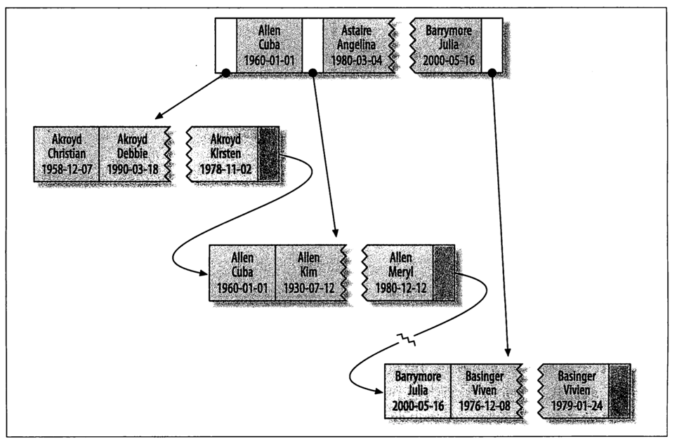

# MySQL 读书笔记-索引

MySQ索引在存储引擎层实现不是在服务器层，不同的存储引擎的索引的实现方式不一样。本文重点关注采用B-Tree实现的索引，还有内存引擎使用的哈希索引、空间索引、全文索引不在本文描述范围内。


### 为何使用索引

1. 查询时减少扫描数据量，加快查询速度
2. 避免排序和临时表
3. 将随机IO变为顺序IO


### 索引实现方式

MySQL 索引对于数据查询性能有很重要的影响，好的索引可能能让查询性能提升好几个数量级。MySQL先利用索引查找到对应值，然后根据匹配的索引记录找到对应的数据行。如果索引有多列则列的顺序很重要，因为MySQL有`最左前缀匹配`限制。

MySQL大部分存储引擎支持B-Tree索引，不过每个存储引擎的B-Tree数据结构可能不太一致。**MyISAM采用前缀压缩技术使索引更小，InnoDB按照原始数据格式存储；MyISAM索引通过数据的物理位置引用被索引的行，InndoDB则根据主键引用被索引的行。**





InnoDB有主键索引和非主键索引区分 ，对于主键索引来说叶子节点存放的是整行数据，主键索引又叫`聚簇索引(clustered index)`；非主键索引的叶子节点内容是主键的值，又叫`二级索引(secondary index)`。

```shell
MariaDB [test]> desc tt;
+-------+-------------+------+-----+---------+-------+
| Field | Type        | Null | Key | Default | Extra |
+-------+-------------+------+-----+---------+-------+
| id    | int(11)     | NO   | PRI | NULL    |       |
| k     | int(11)     | NO   | MUL | NULL    |       |
| name  | varchar(20) | YES  |     | NULL    |       |
+-------+-------------+------+-----+---------+-------+

// 搜索Id的B+Tree搜索树
select * from tt where id=100;

// 搜索k的B+Tree搜索树得到id的值，然后在用id值搜索id搜索树，回表
select * from tt where k=5;
```


### 索引与自增主键

索引采用B+Tree数据结构来存储，B+Tree数据结构父接口大于左节点小于右节点，所以数据表在插入数据时索引树存在维护操作，数据插入可能存在页分裂，数据删除存在可能页合并，此时会影响性能。

通常在建表规范中有描述建需要自增主键，自增主键定义`NOT NULL PRIMARY AUTO_INTREMENT`，采用自增主键在插入数据时采用追加操作，不涉及到数据移动，也不会触发叶子节点的分裂。

对于有业务字段做主键的场景，往往不容易保证有序插入，这样数据写成本比较高。此外还有一个考虑点业务主键的大小，假如以身份证作为业务主键，则该字段大小为20字节 ，此时每个二级索引的叶子节点占用20字节，相比用自增主键，二级索引叶子节点主要8字节。**主键长度越小，普通索引的叶子节点就越小，普通索引占用的空间也就越小**。


## 索引查询

B-Tree索引使用的查询场景有：**全值匹配, 最左前缀匹配,列前缀匹配,范围值匹配,精确匹配某一列并范围匹配另一列**。

全值匹配：被索引的每个列在where查询条件里面都有比较值

最左前缀匹配： 假设有多个索引列，where查询条件里面用到了第一列全值匹配

列前缀匹配：假设有多个索引列，where查询条件里面用到了第一列前几个字符匹配

范围值匹配：假设有多个索引列，where查询条件里面用到了第一列 between and 


B-Tree索引限制：

1. 如果不是按照索引的最左列开始查找，则无法使用索引
2. 不能跳过索引的列
3. 如果查询中有某个列的范围查询，则其右边所有列都不能使用索引优化查找 (like)


**MySQ 5.6之后引入一个叫`索引下推`的功能，可以在索引遍历过程中，对索引中包含的字段先做判断，直接过滤掉不满足条件的记录，减少回表次数。**


### 聚簇索引

聚集索引与非聚集索引的区别是，在同一颗B-Tree数据结构中是否同时保存了索引和数据行，当表有聚簇索引时它的数据行放在索引的叶子页中。一个表只能有一个聚簇索引，因为在一个表中数据的存放方式只有一种。**InnoDB 主键使用的是聚簇索引，MyISAM 不管是主键索引，还是二级索引使用的都是非聚簇索引。**InnoDB采用主键聚集数据，如果没有定义主键InnoDB会选择一个唯一的非空索引代替。

​	

聚簇索引优点：

1. 可以把相关数据存储在一起，在一定场景下可以减少IO操作
2. 数据访问更快，因为聚簇索引把索引和数据保存在一起在同一个B-Tree中因此从聚簇索引中获取数据比非聚簇索引查找更快
3. 使用覆盖索引扫描的查询可以直接使用叶节点中的主键值


聚餐索引缺点：

1. 插入速度严重依赖插入顺序，按照主键顺序插入是加载数据到InnoDB表中速度最快的方式 。**使用InnoDB时应该尽可能按主键顺序插入数据并尽可能使用单调增加聚簇键的值来插入新行。**
2. 更新聚簇索引的代价大
3. 基于聚餐索引的表在插入新行或者主键更新需要移动行的时候，可能面临`页分裂`问题，`页分裂`导致表占用更多的磁盘空间
4. 二级索引访问需要两次索引查找，而不是一次。通过二级索引获取对应的主键值，然后根据主键值去聚簇索引中查找对应数据行。这样做的好处当出现数据行移动时减少二级索引的维护工作


### 覆盖索引

如果一个索引包含所有查询字段的值，无需再读取数据行，则称为`覆盖索引`，覆盖索引可以减少搜索次数能够极大的提高查询性能。

```shell
MariaDB [test]> desc fulltest;
+-----------+----------+------+-----+---------+----------------+
| Field     | Type     | Null | Key | Default | Extra          |
+-----------+----------+------+-----+---------+----------------+
| node_id   | int(11)  | NO   | PRI | NULL    | auto_increment |
| prod_id   | char(10) | NO   |     | NULL    |                |
| note_date | datetime | NO   |     | NULL    |                |
| note_text | text     | YES  | MUL | NULL    |                |
+-----------+----------+------+-----+---------+----------------+


MariaDB [test]> explain select node_id from fulltest \G;
*************************** 1. row ***************************
           id: 1
  select_type: SIMPLE
        table: fulltest
         type: index
possible_keys: NULL
          key: PRIMARY
      key_len: 4
          ref: NULL
         rows: 2
        Extra: Using index
        
MariaDB [test]> explain select * from fulltest where note_text='' \G;
*************************** 1. row ***************************
           id: 1
  select_type: SIMPLE
        table: fulltest
         type: ALL
possible_keys: note_text
          key: NULL
      key_len: NULL
          ref: NULL
         rows: 2
        Extra: Using where
1 row in set (0.00 sec)
```


