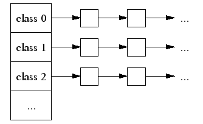
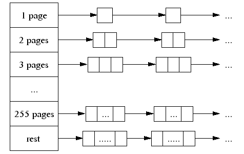

# TCMalloc 

TCMalloc 是Google推出的内存管理库，比较常见的内存池库还有ptmalloc和jemalloc，相比后两者tcmalloc性能更改好，更适用于多线程高并发的场景。Golang 内存管理采用的方法和TCMalloc有点类似。

相比glibc maclloc，tcmalloc更快，根据官方提供的数据，glibc 2.3 malloc在同样的机器上maclloc/free大于需要300纳秒，tcmaclloc的实现只要50纳秒，两者相比差异还是挺大。所以开发者通常会基于glibc malloc峰值一个内存池，程序在启动的时候先向系统申请一大块内存，然后再把申请的大块内存划分为多个空闲列表。tcmalloc就是一个实现了这样的内存管理库。

简单来说，TCMalloc内存分配策略采用分级策略，一个是线程私有内存池，另一个是全局内存池。对于一些小内存的分配则直接在线程私有内存池中分配，无需加锁，大大地减小内存分配锁竞争，只有在线程私有内存不够时则从全局内存池分配。对于大容量的内存分配则直接从全局内存池中分配，这个时候则需要加锁。内存池的组织形式采用数组 + 链表的方式，数组的每个元素是一个链表，链表中每个元素大小则相同。

TCMalloc为每个线程分配一个线程本地缓存。线程本地缓存满足小分配。根据需要将对象从中央数据结构移动到线程本地缓存中，并使用定期垃圾回收将内存从线程本地缓存迁移回中心数据结构中

TCMalloc将大小小于等于32K的对象（“小”对象）与大对象区别对待。使用页面级分配器（页面是内存的4K对齐区域）直接从中央堆分配大对象。即，大对象始终是页面对齐的，并且占据整数页。

## 小对象分配

每个线程会包含一个数组链表，同一个链表中拥有相同大小的空闲对象。

当分配一个小对象时，主要分配的步骤如下：

- 根据要分配对象的大小，映射到相应的大小类
- 在线程私有内存池中相应大小类的空闲链表
- 如果空闲链表不为空，则返回第一个空闲对象，不需要加锁
- 如果空闲链表为空，则需要从全局内存池中获取空闲对象

## 大对象分配

对于大于32K的大对象分配则由全局内存来分配。全局内存的组织也是单链表数组，数组长度为256，分别对用1 page大小, 2 page大小(1 page=4k)

参考文档：

1. [官网文档](http://goog-perftools.sourceforge.net/doc/tcmalloc.html)
2. http://legendtkl.com/2015/12/11/go-memory/#comments

